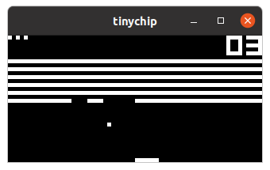
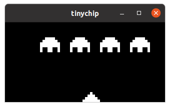
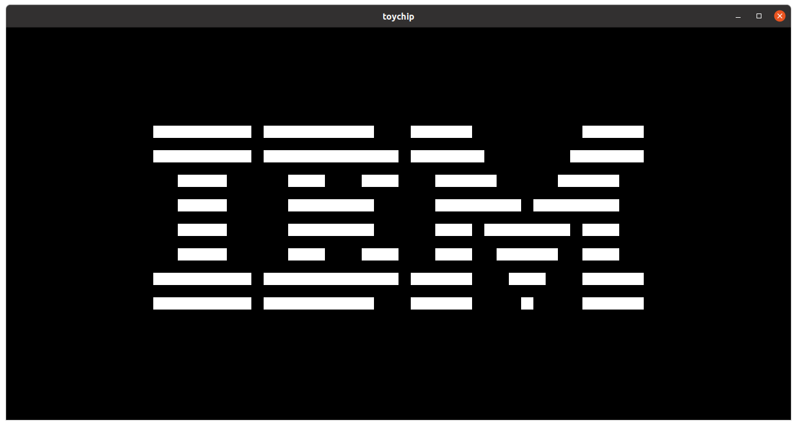

# ❇️ tinychip

*CHIP-8 is an interpreted programming language, developed by Joseph Weisbecker made on his 1802 Microprocessor. It was initially used on the COSMAC VIP and Telmac 1800 8-bit microcomputers in the mid-1970s.* - *[Wikipedia](https://en.wikipedia.org/wiki/CHIP-8)*

It is able to supports multiple graphical APIs and multiple interpreter implementations.
We consider an instruction ~= 1 cycle, so 500hz means it executes 500 instructions per second.

## 📖 How to build and run ?

1. Install the dependencies
    - `cargo`
    - `SDL2` (as library)
2. Compile and install it
    - `cargo install --path .`
3. Run `tinychip --help`

## 👍 Tested programs

Name           | Status
-------------  | :-------------:
IBM logo | ✅
Pong | ✅
Space invaders | ✅
Tetris | ✅

## 🖼️ Screenshots

#### Breakout (320x160 - 500hz)


#### Space Invaders (320x160 - 500hz)


#### IBM logo (640x320 - 500hz)


## ⌨️ Corresponding hotkeys

|   |   |   |   |
|---|---|---|---|
| **1** | **2** | **3** | **4** |
| **A** | **Z** | **E** | **R** |
| **Q** | **S** | **D** | **F** |
| **W** | **X** | **C** | **V** |

## 🔗 Compatibility

Some descriptions of the chip8 instructions differ depending on the machine. For example, the instructions `8xy6` and `8xye` do not do the same thing according to the documents.

In general throughout the documents there are two kinds of semantic for the load operations (`fx55`, `fx65`) and for the shift operations (`8xy6`, `8xye`).

#### Semantics

To use the original semantic, use the following flags:
- Load : `--original-load=true`
- Shift : `--original-shift=true`

Opcode | Default | Original
:-------------: | :---------: | :--------------:
**8xy6** | Vx = Vx >> 1, Vf = carry | Vx = Vy >> 1, Vf = carry
**8xye** | Vx = Vx << 1, Vf = carry | Vx = Vy << 1, Vf = carry
**fx55** | I = I + x + 1 | ❌
**fx65** | I = I + x + 1 | ❌

#### Games

Some games where we know the best compatibility settings, [Github issue](https://github.com/Diesel-Net/kiwi-8/issues/9).

## ℹ️ CLI help

```
USAGE:
    tinychip [OPTIONS] <rom>

FLAGS:
        --help       Prints help information
    -V, --version    Prints version information

OPTIONS:
        --api <api>                          Graphical API, value(s): sfml, sdl
        --cycles <cycles>                    Cycle(s) per second (Hz)
    -h, --height <height>                    Window height
        --interpreter <interpreter>          Interpreter, value(s): original
        --original-load <original-load>      use the original semantic for fx55, fx65
        --original-shift <original-shift>    use the original semantic for 8xy6, 8xye
    -w, --width <width>                      Window width

ARGS:
    <rom>    Input file
```

## 🐋 Docker playground

#### 🔨 Build

```bash
docker build -t tinychip .
```
#### 🎉 Run example

In the example below, we have:

- `X11` as graphic server
- `PulseAudio` as sound server

```bash
docker run -it \
    -e DISPLAY=$DISPLAY \
    -v /tmp/.X11-unix:/tmp/.X11-unix \
    -v /dev/dri:/dev/dri \
    -v /dev/snd:/dev/snd \
    -v $PWD/roms:/roms \
    -v /run/user/$(id -u)/pulse/native:/run/user/$(id -u)/pulse/native \
    -e PULSE_SERVER=unix:/run/user/$(id -u)/pulse/native \
    -u $(id -u):$(id -u) \
    tinychip /roms/brick.ch8
```

## ✅ Todo

Name           | Status
-------------  | :-------------:
500Hz clock | ✅
Basic instructions | ✅
Handle every CLI args **¹** | ✅
Debug features **²** | ⚠️
Create font | ✅
Add beep sound | ✅
60Hz delay and sound timers | ✅

**¹** CLI args:
* Clock (optional)
* Window size (optional)
* Graphical API (optional)
* Interpreter (optional)
* quirks (shift and load)

**²** Features:
* Pause the game
* Show interpreter values like registers, pc, keys, etc..
* Switch between a limited amount of stored emulation state

## ℹ️ Documentation

Run `cargo doc --open` to read the documentation in the browser.
